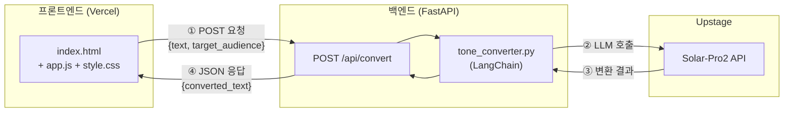

# 업무 말투 변환기 — PRD (제품 요구사항 명세서)

> **대상 독자**: 바이브 코딩(Vibe Coding) 입문 개발자
> **실습 형태**: One Day 프로젝트 (약 4시간)
> **문서 목적**: 오늘 하루 구현의 모든 기준과 명세를 담은 실행 문서
> **연관 문서**: 업무 말투 변환기 — 프로그램 개요서

---

## 목차

1. [완료 체크리스트](#1-완료-체크리스트)
2. [실습 원칙](#2-실습-원칙)
3. [기술 스택 및 사전 준비](#3-기술-스택-및-사전-준비)
4. [기능 요구사항](#4-기능-요구사항)
5. [시스템 아키텍처](#5-시스템-아키텍처)
6. [화면 디자인 및 스타일 가이드](#6-화면-디자인-및-스타일-가이드)
7. [디렉토리 구조](#7-디렉토리-구조)
8. [API 명세](#8-api-명세)
9. [단계별 구현 가이드](#9-단계별-구현-가이드)
10. [바이브 코딩 프롬프트 예시](#10-바이브-코딩-프롬프트-예시)
11. [배포 가이드](#11-배포-가이드)

---

## 1. 완료 체크리스트

> 📌 **규칙 1 적용**: "뭘 만들면 완료인지" 기준을 미리 정의합니다.
> 아래 항목을 모두 체크할 수 있으면 오늘 실습은 완성입니다.

### 백엔드
- [ ] FastAPI 서버가 로컬에서 정상 실행된다 (`uvicorn main:app`)
- [ ] `POST /api/convert` 엔드포인트가 존재한다
- [ ] Upstage Solar-Pro2 API 호출이 정상 작동한다
- [ ] 수신 대상(상사 / 타팀 동료 / 고객 / 팀 내 동료)에 따라 다른 프롬프트가 적용된다
- [ ] CORS 설정이 되어 있어 프론트엔드에서 호출 가능하다
- [ ] `.env` 파일로 API 키를 관리하고, `.gitignore`에 등록되어 있다

### 프론트엔드
- [ ] 텍스트 입력창이 있다
- [ ] 수신 대상 선택 버튼이 있다 (4종)
- [ ] [변환하기] 버튼 클릭 시 API를 호출한다
- [ ] 처리 중 로딩 표시가 나타난다
- [ ] 변환 결과가 화면에 출력된다
- [ ] [복사하기] 버튼이 작동한다

### 배포
- [ ] GitHub 레포지토리에 코드가 올라가 있다
- [ ] Vercel에서 프론트엔드가 정상 접속된다
- [ ] 배포된 URL에서 실제 변환이 작동한다

---

## 2. 실습 원칙

> 바이브 코딩의 **속도**는 살리되, AI에 끌려다니지 않기 위한 4가지 원칙입니다.

---

### 원칙 1. 완료 기준을 먼저 정의하라

**"뭘 만들면 끝인지" 체크리스트를 미리 적어라**

AI도 사람도 "끝"의 기준이 명확해야 헤매지 않습니다.
기준 없이 시작하면 AI는 계속 기능을 추가하고, 하루가 지나도 완성되지 않습니다.

```
✅ 좋은 프롬프트: "오늘 목표는 체크리스트의 항목들만 구현하는 거야.
                  그 외 기능은 추가하지 마."

❌ 나쁜 프롬프트: "업무 말투 변환기 만들어줘."
```

---

### 원칙 2. 새 기술은 조사 먼저, 구현 나중

**5분의 조사가 1시간의 디버깅을 아껴준다**

새로운 라이브러리나 외부 API를 붙이기 전에는 먼저 물어보고 파악한 뒤 구현합니다.
특히 **외부 API 연동, 패키지 버전, 인증 방식**은 반드시 먼저 확인합니다.

```
✅ 좋은 순서:
  1단계: "Upstage Solar-Pro2를 LangChain으로 연동하는 방법을 먼저 알려줘.
          코드는 아직 짜지 말고."
  2단계: 방법 이해 후 → "이제 그 방법으로 구현해줘."

❌ 나쁜 순서:
  바로: "Upstage Solar-Pro2 연동 코드 짜줘."
  → 구버전 API, 잘못된 패키지로 1시간 디버깅 시작
```

---

### 원칙 3. 버그는 분석 먼저, 수정 나중

**"원인부터 알려줘"가 근본 해결로 이어진다**

에러 메시지를 그냥 복붙하면 AI가 임의로 코드를 수정하고,
고쳐지는 것 같다가 다른 에러가 생기는 악순환이 시작됩니다.

```
✅ 좋은 대응:
  "이 에러가 왜 발생하는지 원인을 먼저 설명해줘.
   수정은 원인 파악 후에 같이 진행하자."

❌ 나쁜 대응:
  [에러 메시지 복붙]
  → AI가 임의 수정 → 다른 에러 발생 → 코드가 누더기
```

---

### 원칙 4. 배포 전 내가 한 번은 읽어라

**AI가 만든 코드라도 전체 흐름을 한 번 훑어야 내 것이 된다**

오늘 만든 코드를 이해하지 못한 채로 끝내면, 다음 실습의 출발점이 사라집니다.
배포 전 5분만 투자해서 전체 흐름을 스스로 설명할 수 있는지 확인합니다.

```
✅ 배포 전 셀프 체크:
  - 프론트엔드 → 백엔드 → LLM의 흐름을 말로 설명할 수 있는가?
  - API 요청/응답의 구조를 이해하는가?
  - 오늘 만든 코드에서 내가 직접 수정할 수 있는 부분이 있는가?
```

> 이 네 번째 원칙은 카파시가 바이브 코딩의 다음 단계로 제시한
> **"에이전틱 엔지니어링 — AI가 짜도 개발자가 감독·이해한다"** 의 정신과 일치합니다.

---

## 3. 기술 스택 및 사전 준비

### 기술 스택

| 영역 | 기술 | 비고 |
|------|------|------|
| 프론트엔드 | HTML5 / CSS3 / JavaScript (ES6+) | 프레임워크 없음 |
| 백엔드 | Python 3.11+ / FastAPI / Uvicorn | |
| AI 연동 | LangChain / Upstage Solar-Pro2 | |
| 환경 변수 | python-dotenv | `.env` 파일 관리 |
| 버전 관리 | Git / GitHub | |
| 배포 | Vercel | 프론트엔드 정적 배포 |

### 사전 준비 체크리스트

```bash
# 1. Python 버전 확인
python --version  # 3.11 이상

# 2. pip 패키지 설치
pip install fastapi uvicorn langchain python-dotenv
pip install langchain-upstage   # Upstage LangChain 패키지

# 3. Upstage API 키 발급
# https://console.upstage.ai 에서 발급 후 .env 파일에 저장

# 4. Git 설치 확인
git --version

# 5. Vercel CLI 설치 (선택)
npm install -g vercel
```

### `.env` 파일 구성

```bash
# .env
UPSTAGE_API_KEY=your_api_key_here
```

> ⚠️ `.env` 파일은 절대 GitHub에 올리지 않습니다. `.gitignore`에 반드시 추가하세요.

---

## 4. 기능 요구사항

### 필수 기능 (오늘 구현)

| ID | 기능 | 설명 |
|----|------|------|
| F-01 | 텍스트 입력 | 사용자가 변환할 원문을 자유롭게 입력 |
| F-02 | 수신 대상 선택 | 상사 / 타팀 동료 / 고객 / 팀 내 동료 중 선택 |
| F-03 | 말투 변환 처리 | FastAPI → LangChain → Solar-Pro2 호출 |
| F-04 | 결과 출력 | 변환된 텍스트를 화면에 표시 |
| F-05 | 로딩 표시 | API 호출 중 처리 중 상태 표시 |
| F-06 | 결과 복사 | 변환 결과를 클립보드에 복사 |

### 제외 기능 (오늘 구현하지 않음)

| 기능 | 제외 이유 |
|------|-----------|
| 로그인 / 회원 기능 | One Day 범위 초과 |
| 변환 이력 저장 | DB 구성 필요 |
| 디자인 고도화 | 핵심 기능 우선 |
| 에러 재시도 로직 | 복잡도 증가 |

---

## 5. 시스템 아키텍처



### 수신 대상별 프롬프트 전략

| 대상 코드 | 대상 | 시스템 프롬프트 방향 |
|-----------|------|---------------------|
| `boss` | 상사 / 임원 | 격식 있는 경어체, 공손하고 간결하게 |
| `colleague` | 타팀 동료 | 정중하되 협조적인 업무 어조 |
| `client` | 고객 / 외부 | 친절하고 신뢰감을 주는 서비스 어조 |
| `team` | 팀 내 동료 | 간결하고 실무적인 어조 |

---

## 6. 화면 디자인 및 스타일 가이드

### 6.1 디자인 컨셉
- **Professional & Clean**: 신뢰감을 주는 블루/인디고 컬러 톤 사용
- **Simple UX**: 한 눈에 흐름이 보이는 단일 페이지 구성 (Single Page App 느낌)

### 6.2 주요 레이아웃 구성
1. **Header**: 서비스 로고 및 타이틀 ("업무 말투 변환기")
2. **Input Section**:
   - 원문 입력창 (Textarea): "원문을 입력하세요..." (Placeholder)
3. **Selection Section**:
   - 수신 대상 선택 (4개 버튼): 상사 / 타팀 동료 / 고객 / 팀 내 동료
4. **Action Section**:
   - [변환하기] 버튼: 눈에 띄는 강조 컬러 적용
5. **Output Section**:
   - 결과 출력창 (Read-only Textarea)
   - [복사하기] 버튼: 하단 배치
6. **Footer**: 카피라이트 및 관련 링크

### 6.3 스타일 상세 (CSS 가이드)
- **Primary Color**: `#2563eb` (Indigo-600) - 포인트 컬러
- **Secondary Color**: `#f8fafc` (Slate-50) - 배경색
- **Border**: `1px solid #e2e8f0`, `border-radius: 8px`
- **Typography**: Pretendard 또는 시스템 기본 폰트 (Sans-serif)

### 6.4 상태 UI (Interactive UX)
- **Button Hover**: 마우스 오버 시 색상 변화
- **Active State**: 선택된 수신 대상 버튼은 강조색 배경 + 흰색 글씨
- **Loading State**: 변환 중 버튼 비활성화 및 스피너(또는 "변환 중..." 텍스트) 표시

---

## 7. 디렉토리 구조

```
├── .venv/                      # 가상환경 폴더 (STEP 1 생성, git 제외)
├── .gitignore                  # Git 제외 목록 (.env, .venv, __pycache__ 등)
├── README.md                   # 프로젝트 개요 및 실행 방법
├── .env                    # Upstage API 키 (STEP 1 생성, git 제외)
├── .env.example            # 환경 변수 샘플 파일
│
├── backend/                    # 백엔드 서버 (FastAPI)
│   ├── main.py                 # FastAPI 앱 설정, CORS 및 라우터 통합
│   ├── requirements.txt        # 의존성 패키지 목록 (langchain, fastapi 등)
│   ├── models/
│   │   └── schemas.py          # Pydantic 기반 데이터 검증 모델 (STEP 2-1)
│   ├── prompts/
│   │   └── templates.py        # 대상별 프롬프트 템플릿 (STEP 2-2)
│   ├── services/
│   │   └── tone_converter.py   # LangChain 연동 및 변환 로직 (STEP 2-3)
│   └── routers/
│       └── convert.py          # API 엔드포인트 정의 (STEP 2-4)
│
└── frontend/                   # 프론트엔드 (Static HTML/CSS/JS)
    ├── index.html              # 메인 UI 레이아웃 (STEP 3-1)
    ├── css/
    │   └── style.css           # UI 디자인 및 스타일링 (STEP 3-2)
    └── js/
        └── app.js              # 버튼 이벤트 및 API 연동 로직 (STEP 3-3)
```

---

## 8. API 명세

### `POST /api/convert`

#### 요청

```http
POST /api/convert
Content-Type: application/json
```

```json
{
  "text": "내일까지 보고서 제출 어려울 것 같음",
  "target_audience": "boss"
}
```

| 필드 | 타입 | 필수 | 허용값 |
|------|------|------|--------|
| `text` | string | ✅ | 1자 이상 |
| `target_audience` | string | ✅ | `boss` / `colleague` / `client` / `team` |

#### 응답 — 성공 `200 OK`

```json
{
  "converted_text": "안녕하세요. 보고서 제출 일정과 관련하여 말씀드립니다. 예상치 못한 사정으로 내일까지 제출이 어려울 것 같습니다. 일정 조율이 가능하신지 여쭤봐도 될까요?",
  "target_audience": "boss",
  "original_text": "내일까지 보고서 제출 어려울 것 같음"
}
```

#### 응답 — 오류 `422`

```json
{
  "detail": "text 필드는 필수입니다."
}
```

#### 응답 — 오류 `500`

```json
{
  "detail": "LLM API 호출 중 오류가 발생했습니다."
}
```

### `GET /health`

```json
{ "status": "ok" }
```

---

## 9. 단계별 구현 가이드

### STEP 1. 환경 준비 (30분)

1. **가상환경 설정**
   - 가상환경을 생성하고 가상환경을 활성화합니다.
   ```bash
   python -m venv .venv
   .venv\Scripts\activate  # Windows (PowerShell/CMD)
   # source .venv/bin/activate  # Mac/Linux
   ```

2. **디렉토리 구조 생성 (섹션 7 참고)**
   - 백엔드와 프론트엔드 폴더 구조를 미리 만듭니다.
   ```bash
   mkdir -p backend/routers backend/services backend/prompts backend/models
   mkdir -p frontend/css frontend/js
   ```

3. **환경 변수 및 보안 설정**
   - `.gitignore` 파일을 생성하여 민감한 정보가 노출되지 않게 합니다.
   - `.env` 파일을 생성하고 발급받은 Upstage API 키를 저장합니다.
   ```bash
   # .gitignore 작성
   echo ".env" >> .gitignore
   echo ".venv/" >> .gitignore
   echo "__pycache__/" >> .gitignore

   # .env 작성
   echo "UPSTAGE_API_KEY=your_api_key_here" >> backend/.env
   ```

4. **의존성 패키지 설치**
   - `backend/requirements.txt`를 작성하고 필요한 라이브러리를 설치합니다.
   ```bash
   cd backend
   # 섹션 11의 내용을 requirements.txt에 복사 후 실행
   pip install -r requirements.txt
   cd ..
   ```

5. **Git 초기화 및 첫 커밋**
   - GitHub 레포지토리를 연결하기 전 로컬 저장소를 초기화합니다.
   ```bash
   git init
   git add .
   git commit -m "Initial commit: Project environment setup"
   ```

---

### STEP 2. 백엔드 구현 (90분)

> 📌 **원칙 2 적용**: 구현 전 Solar-Pro2 연동 방식을 먼저 확인하세요. (섹션 10 프롬프트 활용)

**1. 데이터 모델 정의 (`models/schemas.py`)**
   - Pydantic을 사용하여 API의 요청과 응답 형식을 정의합니다.
   - `ConvertRequest`: 원문(`text`)과 수신 대상(`target_audience`) 필드 포함
   - `ConvertResponse`: 변환된 텍스트와 메타데이터 포함

**2. 프롬프트 템플릿 작성 (`prompts/templates.py`)**
   - 섹션 5의 전략에 따라 4가지 대상별 시스템 프롬프트를 딕셔너리 형태로 저장합니다.
   - 각 대상의 특징(격식, 정중, 친절, 간결)이 잘 드러나도록 지시문을 상세히 적습니다.

**3. 핵심 변환 로직 구현 (`services/tone_converter.py`)**
   - `langchain-upstage` 패키지의 `ChatUpstage`를 초기화합니다.
   - 사용자가 선택한 `target_audience`에 맞는 프롬프트를 선택하는 로직을 작성합니다.
   - `ChatPromptTemplate`을 사용하여 시스템 메시지와 사용자 메시지를 조합하고 LLM을 호출합니다.

**4. API 라우터 구현 (`routers/convert.py`)**
   - FastAPI의 `APIRouter`를 생성합니다.
   - `POST /convert` 엔드포인트를 만들고, 요청 데이터를 `tone_converter` 서비스로 전달합니다.
   - 예외 처리(LLM 호출 실패 등)를 추가하여 안정성을 높입니다.

**5. 메인 앱 설정 (`main.py`)**
   - FastAPI 객체를 생성하고 생성한 라우터를 연결합니다.
   - **중요**: 프론트엔드 통신을 위해 `CORSMiddleware`를 설정합니다. (`allow_origins=["*"]`)
   - 헬스체크용 `GET /health` 엔드포인트를 추가합니다.

**6. 로컬 서버 실행 및 테스트**
   - 서버를 실행하고 스웨거(Swagger) 문서에서 API를 직접 호출해 봅니다.
   ```bash
   cd backend
   uvicorn main:app --reload --port 8000
   # 브라우저에서 http://localhost:8000/docs 접속 후 테스트
   ```

**핵심 코드 구조 참고**

```python
# schemas.py
from pydantic import BaseModel

class ConvertRequest(BaseModel):
    text: str
    target_audience: str  # boss / colleague / client / team

class ConvertResponse(BaseModel):
    converted_text: str
    target_audience: str
    original_text: str
```

```python
# templates.py
PROMPTS = {
    "boss": "당신은 비즈니스 문서 작성 전문가입니다. "
            "아래 내용을 상사에게 보내는 격식 있고 공손한 업무 메시지로 변환해주세요.",
    "colleague": "당신은 비즈니스 문서 작성 전문가입니다. "
                 "아래 내용을 타팀 동료에게 보내는 정중하고 협조적인 업무 메시지로 변환해주세요.",
    "client": "당신은 비즈니스 문서 작성 전문가입니다. "
              "아래 내용을 고객에게 보내는 친절하고 신뢰감 있는 서비스 메시지로 변환해주세요.",
    "team": "당신은 비즈니스 문서 작성 전문가입니다. "
            "아래 내용을 팀 내 동료에게 보내는 간결하고 실무적인 메시지로 변환해주세요.",
}
```

```python
# main.py 핵심 구조
from fastapi import FastAPI
from fastapi.middleware.cors import CORSMiddleware
from routers import convert

app = FastAPI()

app.add_middleware(
    CORSMiddleware,
    allow_origins=["*"],  # 배포 시 실제 도메인으로 변경
    allow_methods=["*"],
    allow_headers=["*"],
)

app.include_router(convert.router, prefix="/api")
```

---

### STEP 3. 프론트엔드 구현 (60분)

**1. HTML 구조 설계 (`index.html`)**
   - 섹션 6.2의 레이아웃 구성에 따라 HTML 태그를 작성합니다.
   - 각 요소(입력창, 버튼, 결과창 등)에 JavaScript에서 접근하기 위한 고유 `id`를 부여합니다.
   - 수신 대상 버튼들은 그룹화하여 관리합니다.

**2. CSS 스타일링 (`css/style.css`)**
   - 섹션 6.3의 스타일 가이드를 적용하여 디자인을 입힙니다.
   - **레이아웃**: `flex` 또는 `grid`를 사용하여 중앙 정렬 및 여백을 조절합니다.
   - **상태 변화**: `:hover`, `:active` 가상 클래스와 `.active` 클래스(선택된 버튼용) 스타일을 정의합니다.
   - **반응형**: 모바일에서도 보기 편하도록 최대 너비를 제한하고 패딩을 조절합니다.

**3. JavaScript 기능 구현 (`js/app.js`)**
   - **버튼 토글 로직**: 수신 대상 버튼 클릭 시 기존 `.active` 클래스를 제거하고 클릭된 버튼에 추가합니다.
   - **API 통신**: [변환하기] 버튼 클릭 시 `fetch`를 사용하여 백엔드 `/api/convert`에 데이터를 보냅니다.
   - **UI 업데이트**: 
     - 통신 시작 시 로딩 스피너를 보여주고 버튼을 비활성화합니다.
     - 결과 수신 후 결과창에 텍스트를 출력하고 로딩 상태를 해제합니다.
   - **복사 기능**: `navigator.clipboard.writeText()`를 사용하여 결과 텍스트를 클립보드에 복사합니다.

**4. 브라우저 테스트**
   - `index.html`을 브라우저로 열어 화면이 의도한 대로 나오는지 확인합니다.
   - 백엔드 서버가 실행 중인 상태에서 실제로 변환이 일어나는지 테스트합니다.

**핵심 JS 구조 참고**

```javascript
// app.js 핵심 구조
const API_BASE = "http://localhost:8000"; // 배포 시 실제 URL로 변경

async function convertTone() {
    const text = document.getElementById("inputText").value;
    const target = document.querySelector(".target-btn.active")?.dataset.target;

    if (!text || !target) {
        alert("내용을 입력하고 수신 대상을 선택해주세요.");
        return;
    }

    // 로딩 시작
    setLoading(true);

    try {
        const response = await fetch(`${API_BASE}/api/convert`, {
            method: "POST",
            headers: { "Content-Type": "application/json" },
            body: JSON.stringify({ text, target_audience: target }),
        });

        const data = await response.json();
        document.getElementById("outputText").value = data.converted_text;

    } catch (error) {
        alert("변환 중 오류가 발생했습니다. 잠시 후 다시 시도해주세요.");
    } finally {
        // 로딩 종료
        setLoading(false);
    }
}
```

---

### STEP 4. 배포 (30분)

> 📌 **원칙 4 적용**: 배포 전 전체 흐름을 한 번 읽고 이해했는지 확인하세요.

**1. 코드 정리 및 GitHub 푸시**
   - 로컬에서 최종 테스트를 마치고, `.gitignore`가 정상 작동하여 `.env`나 가상환경 폴더가 포함되지 않았는지 확인합니다.
   ```bash
   git add .
   git commit -m "Final: All features implemented and tested"
   git push origin main
   ```

**2. 백엔드 배포 (Render 또는 Railway 추천)**
   - **레포지토리 연결**: 선택한 플랫폼(예: Render)에 GitHub 레포지토리를 연결합니다.
   - **Root Directory**: `backend`로 설정합니다.
   - **Start Command**: `uvicorn main:app --host 0.0.0.0 --port $PORT` (플랫폼 규격에 맞춤)
   - **Environment Variables**: `UPSTAGE_API_KEY` 값을 환경 변수로 등록합니다.
   - **확인**: 배포된 백엔드 URL(예: `https://api-xxx.onrender.com`)을 복사해 둡니다.

**3. 프론트엔드 배포 (Vercel)**
   - **Project 생성**: Vercel 대시보드에서 `Import Project`를 선택하고 레포지토리를 연결합니다.
   - **Root Directory**: `frontend`로 설정합니다.
   - **Build Settings**: 정적 페이지이므로 Build Command는 비워두거나 기본값으로 둡니다.
   - **확인**: 배포된 프론트엔드 URL(예: `https://xxx.vercel.app`)을 확인합니다.

**4. 최종 연동 및 확인**
   - **API URL 수정**: `frontend/js/app.js`의 `API_BASE` 상수를 로컬 주소에서 **실제 배포된 백엔드 URL**로 수정합니다.
   - **CORS 업데이트**: `backend/main.py`의 `allow_origins`에 배포된 프론트엔드 URL을 추가합니다. (또는 테스트를 위해 `["*"]` 유지)
   - **재배포**: 수정한 코드를 다시 GitHub에 `push`하면 플랫폼들이 자동으로 재배포를 수행합니다.
   - **최종 테스트**: 배포된 프론트엔드 URL에 접속하여 실제 변환 기능이 작동하는지 최종 확인합니다.

---

## 10. 바이브 코딩 프롬프트 예시

> Gemini CLI에서 바로 사용할 수 있는 프롬프트 예시입니다.
> **원칙 1~4를 적용한 방식**으로 작성되어 있습니다.

### 환경 파악 (원칙 2 적용)

```
Upstage Solar-Pro2를 LangChain으로 연동하는 최신 방법을 알려줘.
어떤 패키지를 설치해야 하고, ChatUpstage 클래스는 어떻게 사용하는지
코드 없이 방법만 먼저 설명해줘.
```

### 백엔드 구현 요청 (원칙 1 적용)

```
아래 조건에 맞는 FastAPI 백엔드를 만들어줘.

[완료 조건]
- POST /api/convert 엔드포인트
- 요청: { text: string, target_audience: string }
- 응답: { converted_text: string, target_audience: string, original_text: string }
- target_audience는 boss / colleague / client / team 4종
- 각 대상마다 다른 시스템 프롬프트 적용
- Upstage Solar-Pro2 API 사용
- .env에서 UPSTAGE_API_KEY 로드
- CORS 허용

[하지 말 것]
- 로그인, 인증 기능
- DB 저장
- 위 조건 외 추가 기능
```

### 버그 대응 (원칙 3 적용)

```
아래 에러가 발생했어.
수정하기 전에 왜 이 에러가 발생하는지 원인을 먼저 설명해줘.

[에러 메시지]
CORS policy: No 'Access-Control-Allow-Origin' header is present
```

### 프론트엔드 수정 요청

```
index.html에서 수신 대상 버튼을 클릭하면 active 클래스가 토글되도록 해줘.
한 번에 하나만 선택되어야 하고,
선택된 버튼은 배경색이 파란색으로 바뀌어야 해.
CSS도 같이 수정해줘.
```

### 배포 전 코드 리뷰 요청 (원칙 4 적용)

```
오늘 만든 코드의 전체 흐름을 설명해줘.
프론트엔드에서 버튼을 누르는 순간부터
화면에 결과가 출력되기까지의 과정을
비개발자도 이해할 수 있는 말로 설명해줘.
```

---

## 11. 배포 가이드

### `.gitignore` 필수 항목

```
# .gitignore
.env
__pycache__/
*.pyc
.DS_Store
node_modules/
```

### `requirements.txt`

```
fastapi
uvicorn
langchain
langchain-upstage
python-dotenv
pydantic
```

### Vercel 배포 설정

```json
// vercel.json (frontend/ 루트에 위치)
{
  "rewrites": [
    { "source": "/(.*)", "destination": "/index.html" }
  ]
}
```

### 로컬 실행 명령어

```bash
# 백엔드 실행
cd backend
uvicorn main:app --reload --port 8000

# 프론트엔드 확인
# frontend/index.html을 브라우저에서 직접 열기
# 또는 VS Code Live Server 사용
```

---

> 📌 **다음 단계**: 이 PRD를 완성한 뒤에는 각 기능을 확장하거나
> 로그인, 이력 저장 등 추가 기능을 붙여보세요.
> 오늘 만든 구조가 그 출발점이 됩니다.
